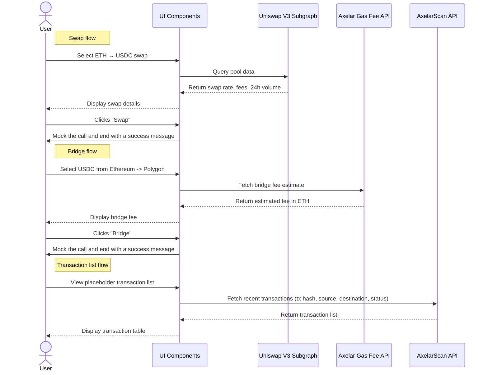

# Cross-Chain Swap App

## Overview

A web app that simulates a Uniswap-like interface where users can:

1. Swap ETH to USDC (simulated, no actual contract calls)
2. Bridge USDC from Ethereum to Polygon (cost estimation only, no actual bridging)
3. View live Axelar cross-chain transactions

## System Architecture

### Frontend
- React + Vite application (no need for a backend here, also not a fan of Next.js)
- Tanstack Query for data fetching (clean, proven, built-in caching, etc)
- TailwindCSS for styling (raw & flexible, no components library)

### External APIs
- Uniswap V3 Subgraph (via The Graph) - For pool data and swap rates
- Axelar Gas Fee API - For bridge fee estimates
- AxelarScan API - For recent cross-chain transactions

In the real world, you'd want to use a backend of your own to handle the API calls and data processing.
That is because you want to keep your API keys secret.
But for the purpose of this take home assignment, I don't think it's necessary.

## Making sense of the requirements

A few things in the requirements in the PDF are funky.

The flow is explained as:
1. Fetch uniswap pool data (Ethereum Mainnet)
2. Simulate "cross-chain" swap
3. Fetch Axelar bridge fee estimate

This particular flow is weird because it doesn't make sense to simulate a cross-chain swap before fetching the bridge fee estimate.

But then there's a quote "Fetch Axelar Bridge Fee Estimate" section:
> Assume the user bridges USDC from Ethereum to Polygon after swapping

Which makes me thing it should be a 2-step flow, not a 1-step cross-chain ("all in one") flow.

Now, I could go either way on this.

Fetch both uniswap pool data and bridge fee estimate in the same call.
Then display a cross-chain swap button.
From a UX perspective this is a lot cooler.
It would be more work for the smart cotnract / backend devs though because they'd have to figure out a routing mechanism that handles the swap + bridge flow in a single transaction.

Or I could go the route that is simpler for them.
Which is to do a swap first, then a bridge.

I'll go with the latter as outlined below.

## Other Considerations

### Testing Strategy

Manual testing will have to do for the take home.

### No auth

In a normal app I'd also add wallet connection.
Here I won't because:
- we don't need it to make API calls
- it's not a specified requirement in the PDF
- we're time constrained

## Resources

A lot of the resources in the PDF are broken links, so I collected the following:

[Arbitrum Uniswap V3 Subgraph](https://thegraph.com/explorer/subgraphs/5zvR82QoaXYFyDEKLZ9t6v9adgnptxYpKpSbxtgVENFV?view=Query&chain=arbitrum-one): 
I haven't worked with The Graph recently, but it seems a lot of things have changed. Ethereum is deprecated. Uniswap seems to expect you to build your own subgraphs vs the company providing them (like we did at Toucan back in the day). I could've deployed my own subgraph, but I didn't want to spend time on that. Calling the arbitrum-one subgraph was the next best thing that still shows I can query the data.

- [Gas estimation](https://docs.axelar.dev/dev/gas-service/pay-gas/)
- [AxelarJS SDK](https://docs.axelar.dev/dev/axelarjs-sdk/intro/)
- [GMP](https://docs.axelar.dev/dev/general-message-passing/verify-gmp-tx/)
- [AxelarScan](https://docs.axelarscan.io/axelarscan)